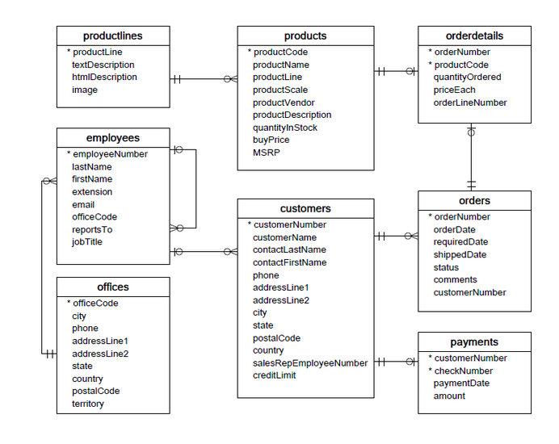

# Product-Analysis-using-SQL-Dataquest
## Project Description 
The focus of this project is to analyze data from sales record database and extract key performance indicators (KPI)s that help make data driven decisions regarding the product. In this project, a model cars database is been analyzed, to derrive KPIs in order to understand which cars should be ordered less or more, how the company should tailor the communication and strategies to customer behavior and how much should be spent on acquiring new customers. 
## Database Schema
 shows how each tables are related. Each table includes the follwoing information. 
    
- **Customers**: customer data
- **Employees**: all employee information
- **Offices**: sales office information
- **Orders**: customers' sales orders
- **OrderDetails**: sales order line for each sales order
- **Payments**: customers' payment records
- **Products**: a list of scale model cars
- **ProductLines**: a list of product line categories
## Query Explaination

### 1. Calculating the number of attributes and rows in each table

In order to analyze the information about each table **PRAGMA_table_info(<table_name>)** SQL statement was used. The results of this SQL query would be a table containing a row for each column of the table which describes the data in the cloumn. The output for the *payment* table would look like as below:

|cid|name|type|notnull|dflt_value|pk|
|--|--|--|--|--|--|
|0|customerNumber|INTEGER|1| |1|
|1|checkNumber|nvarchar(50)|1| |2|
|2|paymentDate|date|1| | 0|
|3|amount|numeric(10,2)|1| |0 |

Each column of the above table explains : 
- **name** : Name of the attributes of the table 
- **type** : The data type of the each attribute
- **notnull** : signifies whether the column has been created as a notnull column or not
- **dflt**: Any default values that were passed during the creation of the table
- **pk**: Signifies wheter a particular column has been used as a primary key. Boolean values are used to represent the result.

Number of attributes for each table is calculated  using the **COUNT** SQL aggregation on the table derrived from PRAGMA table_info query. The number of rows for each table is  calculated by quering the **COUNT** SQL aggregation on each table individually. Finally the above results from each table and their table names are consolidated using the **UNION ALL** SQL aggregation and represented in a tabular format. 

### 2. Identifying restock products 
Priority products that need to be restocked are the best selling products and the ones that are in the brink of being  out of stock. To avoid the best selling product going out of stock, the product performance should be tracked, while low stock items should be tracked to avoid any product being out of the stock. 

The **low stock** is defined as : 

```low stock = SUM(product Quantity Ordered)/ ( Quantity of product in stock) ```

The **product performance** is defined as : 

``` product performance = SUM(Quantity orderd x Selling price of eacg unit) ```

 Top 10 priority products that needs to be restocjed are identified using, **Common Table Expression(CTE)** are created for *low_stock* and *product_performance*, using **products** and **orderdetails** tables.Then **IN** operator was used to find the products which are common in both CTEs, by filtering them using the common **productCode** which is the foreign key between **products*8 and **orderdetails** table.

### 3. Examining Customer Behavior
Analyzing customer engagement is important when deciding marketing and communication strategies. Top VIP customers and least engaging customers are identified to decide which category of customers should be targeted for different programs which are designed to attract more customers and reward loyalty members. Profit incurred on customers are calculated to identify the top and least enagaging customers. 

The **profit** is calculated as : 
``` profit = SUM(quantityOrderd(price Each-Buy price))```

**products**, **orderdetails**, **customers** and **orders** tables were joined using a **JOIN** SQL aggregation **ON** corresponding foreign keys that links database tables, to calculate the profit . The rows are **ORDERBY** the calculated profit column in the descending order. 

*Top five VIP Customers*
|last name|first name|city|country|customernumber|profit|
|--|--|--|--|--|--|
|Freyre| Diego|Madrid|Spain|141|326519.66|
|Nelson|SusanSan| Rafael|USA|124|236769.39|
|Young|Jeff|NYC|USA|151|72370.09|
|Ferguson|Peter|Melbourne|Australia|114|70311.07|
|Labrune|Janine|Nantes|France|119|60875.3|

*Five least engaging customers*
|last name|first name|city|country|customernumber|profit|
|--|--|--|--|--|--|
|Bertrand|Marie|Paris|France|172|34650.17|
|Accorti|Paolo|Torino|Italy|249|34100.63|
|Salazar|Rosa|Philadelphia|USA|486|33598.57|
|Yoshido|Juri|Boston|USA|362|32549.53|
|Brown|William|Newark|USA|328|32240.57|


### 4. Amount spend on aquiring new customers 

This is calculated using the average lifetime value (LTV) of a customer. LTV is the average profit generated by a customer during their lifetime of being a customer. Depending on the LTV of a customer, the future profit can be predicted in order to decide how much amount to spend on programs to acquire new customers. **AVG** SQL aggregation can be performed to find the average profit generated by each customer.

As given in the following code, the approximate number of new customers arriving on each month is calculated, to find the worth of  investing on new customers.
```WITH 

payment_with_year_month_table AS (
SELECT *, 
       CAST(SUBSTR(paymentDate, 1,4) AS INTEGER)*100 + CAST(SUBSTR(paymentDate, 6,7) AS INTEGER) AS year_month
  FROM payments p
),

customers_by_month_table AS (
SELECT p1.year_month, COUNT(*) AS number_of_customers, SUM(p1.amount) AS total
  FROM payment_with_year_month_table p1
 GROUP BY p1.year_month
),

new_customers_by_month_table AS (
SELECT p1.year_month, 
       COUNT(DISTINCT customerNumber) AS number_of_new_customers,
       SUM(p1.amount) AS new_customer_total,
       (SELECT number_of_customers
          FROM customers_by_month_table c
        WHERE c.year_month = p1.year_month) AS number_of_customers,
       (SELECT total
          FROM customers_by_month_table c
         WHERE c.year_month = p1.year_month) AS total
  FROM payment_with_year_month_table p1
 WHERE p1.customerNumber NOT IN (SELECT customerNumber
                                   FROM payment_with_year_month_table p2
                                  WHERE p2.year_month < p1.year_month)
 GROUP BY p1.year_month
)

SELECT year_month, 
       ROUND(number_of_new_customers*100/number_of_customers,1) AS number_of_new_customers_props,
       ROUND(new_customer_total*100/total,1) AS new_customers_total_props
  FROM new_customers_by_month_table;
```

## Conclusioin
Based on the results analysis, 
- Product Line of **"Classic cars"**  have the highest performance with the lowest stock. 
- **1968 Ford Mustang** is the product that has the highest demand.
- Top five VIP customers are from countries Spain, USA, Australia and France.
- Top two VIP customers have generated a profit above 200,000 which is significantly higher value compared to profit generated by next top three VIP customers which is in the range of 60,000- 73,000.
 - Least engaged customers are from the countries USA,Italy, France and UK in which the least generated profit by a customer is below 3000.
 - Hence the company has generated an average profit of **39039.594388** from a customer in their LTV, investing on acquiring more customers 
 to the cmpany could increase the profit generated, with taking critical factors such as country with highest sales,  year-month that most sales happened in to consideraion.


